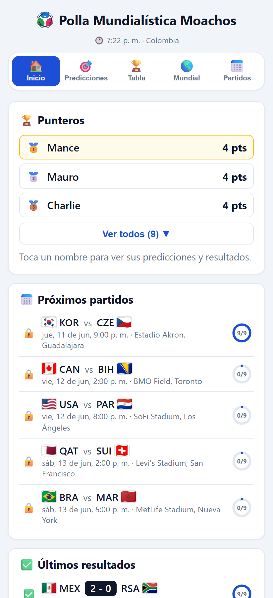
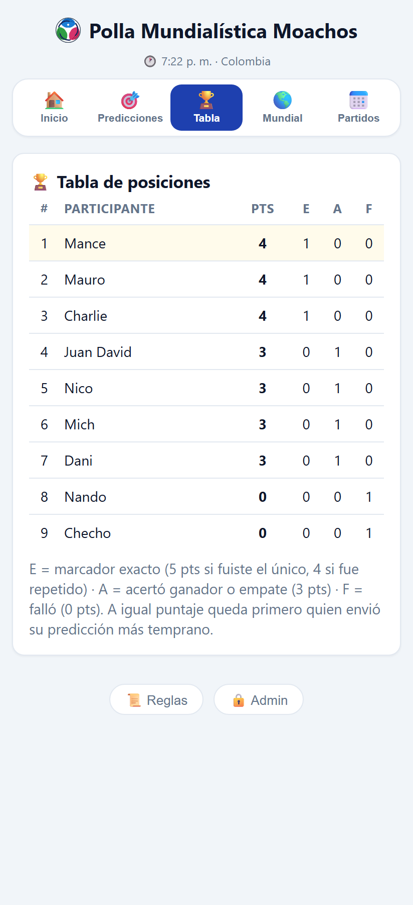
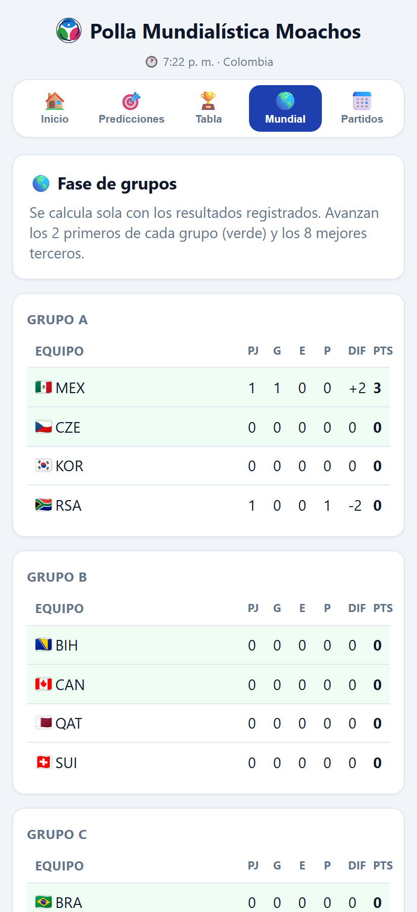
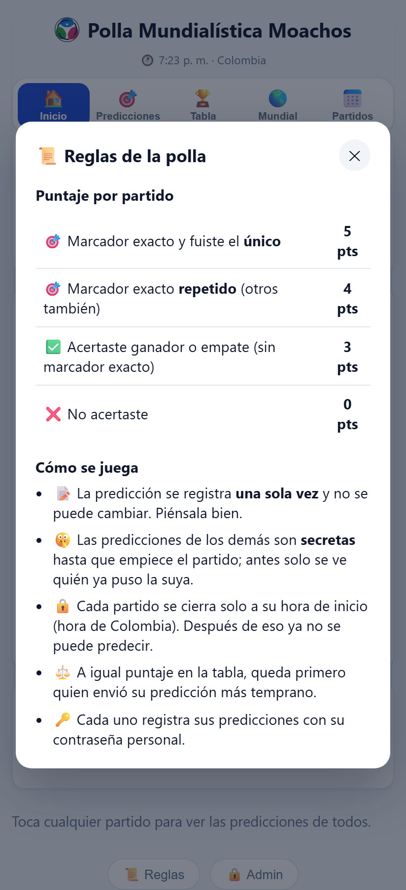
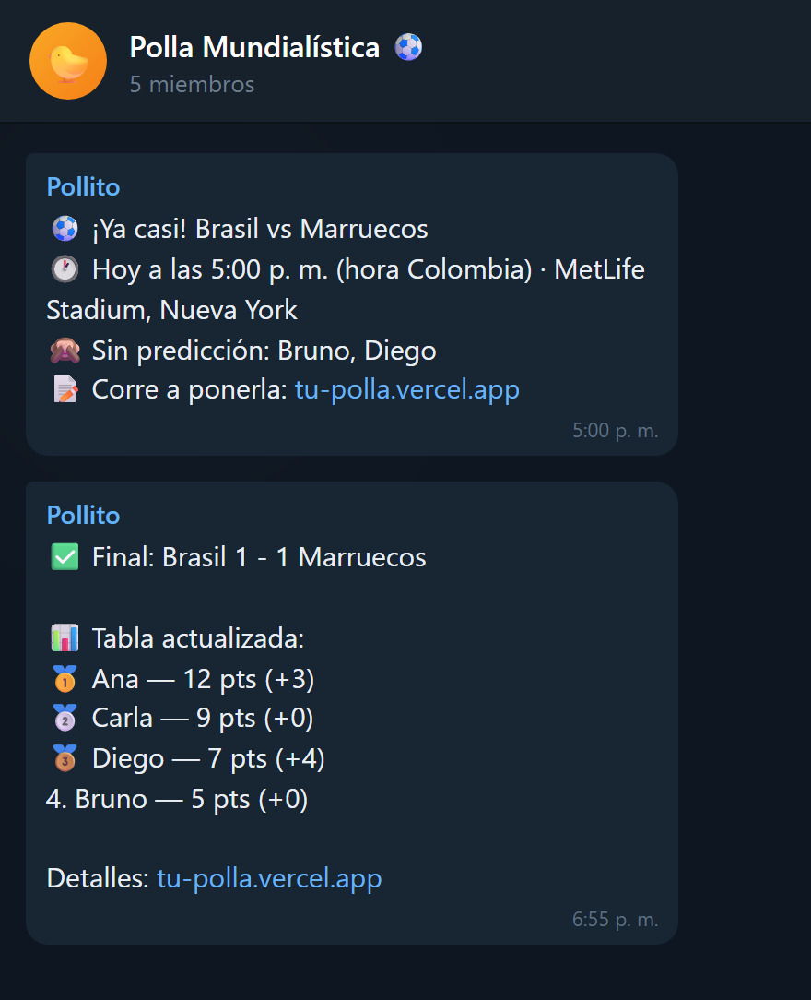

# ⚽ Polla Mundialística

**Español** · [English](README.en.md)

App web para administrar una **polla (quiniela) del Mundial** entre amigos. Cada quien predice los
marcadores, los puntos se calculan solos y hay tabla de posiciones, fase de grupos y bracket de
eliminatorias en vivo. Mobile-first, en español, **100 % gratis de hostear**.

> Hecha para el **Mundial 2026** (los 72 partidos de fase de grupos ya vienen cargados con fecha, hora
> de Colombia y estadio). Fácil de adaptar a cualquier torneo.

<p align="center">
  
  
  
  
</p>

## ✨ Características

- 📝 **Predicciones por persona**, cada una con su contraseña. Se registran **una sola vez** y son
  **secretas** hasta que el partido empieza (solo se ve quién ya predijo).
- 🔒 **Bloqueo automático** de cada partido a su hora de inicio (anclado a hora de Colombia, UTC-5).
- 🏆 **Tabla de posiciones** automática con sistema de puntos y desempate por hora de envío.
- 🌎 **Fase de grupos** (12 grupos), mejores terceros y **bracket de eliminatorias** que se llena solo.
- 🔄 **Resultados automáticos** desde [football-data.org](https://www.football-data.org) (opcional).
- 🔔 **Alertas a un grupo de Telegram** antes de cada partido y al terminar (opcional).
- 📱 Diseño mobile-first; se ve bien en iPhone y Android.
- 🆓 Corre gratis en **Vercel + Turso** (sin tarjeta) o localmente con SQLite.

## 🏆 Reglas de puntos

| Acierto | Puntos |
|---|---|
| Marcador exacto y fuiste el **único** en acertarlo | **5** |
| Marcador exacto **repetido** (otros también lo acertaron) | **4** |
| Ganador o empate (sin marcador exacto) | **3** |
| No acertó | **0** |

A igual puntaje, queda primero quien **envió su predicción más temprano**. El admin puede **cambiar
estos valores** desde **⚙️ Configuración** (recalcula la tabla retroactivamente). Una vez que el
partido empieza, **nadie —ni el admin— puede modificar** la predicción de un participante.

## 🚀 Despliega la tuya gratis (Vercel + Turso)

[](https://vercel.com/new/clone?repository-url=https%3A%2F%2Fgithub.com%2Fmichikyu%2Fpolla-mundialista&env=ADMIN_PASSWORD,TURSO_DATABASE_URL,TURSO_AUTH_TOKEN&envDescription=Contrase%C3%B1a%20de%20admin%20y%20credenciales%20de%20tu%20base%20Turso)

No necesitas tarjeta de crédito.

1. **Haz fork** de este repo a tu cuenta de GitHub.
2. **Crea la base de datos** en [Turso](https://turso.tech) (plan gratis): crea una base y copia su
   **Database URL** y un **Auth Token**.
3. **Importa el repo en [Vercel](https://vercel.com)** (New Project → tu fork). Framework: *Vite*.
4. **Configura las variables de entorno** en Vercel (Settings → Environment Variables):

   | Variable | ¿Obligatoria? | Para qué |
   |---|---|---|
   | `ADMIN_PASSWORD` | ✅ Sí | Contraseña de administrador (registrar resultados, editar todo) |
   | `TURSO_DATABASE_URL` | ✅ Sí | URL de tu base Turso |
   | `TURSO_AUTH_TOKEN` | ✅ Sí | Token de tu base Turso |
   | `FOOTBALL_DATA_TOKEN` | ⚪ Opcional | Resultados automáticos ([token gratis](https://www.football-data.org/client/register)) |
   | `TELEGRAM_BOT_TOKEN` | ⚪ Opcional | Alertas a Telegram (crea un bot con [@BotFather](https://t.me/BotFather)) |
   | `TELEGRAM_CHAT_ID` | ⚪ Opcional | ID del grupo de Telegram (número negativo) |
   | `CRON_SECRET` | ⚪ Recomendada | Protege el cron de notificaciones (Vercel lo envía solo) |
   | `VITE_APP_TITLE` | ⚪ Opcional | Título de la app (por defecto "Polla Mundialística"). También se cambia en vivo desde **⚙️ Configuración** en modo admin. |

5. **Deploy.** Listo: tu polla queda en `https://tu-proyecto.vercel.app`.
6. **Personaliza los participantes:** entra, toca **🔒 Admin** (abajo) con tu `ADMIN_PASSWORD`, ve a
   **Tabla** y agrega/edita a tus amigos con su contraseña personal.

> 💡 Los 4 participantes de ejemplo (`Ana`, `Bruno`, `Carla`, `Diego`) y sus contraseñas viven en
> [`server/fixtures.ts`](server/fixtures.ts); cámbialos ahí antes del primer arranque o desde la
> pestaña **Tabla** en modo admin.

## 💻 Correr localmente (opcional)

Requiere [Node.js](https://nodejs.org) 20+.

```bash
npm install
npm run dev
```

Abre <http://localhost:5173>. Sin variables de entorno usa una base local SQLite en `data/polla.db`
y la contraseña de admin por defecto es `changeme` (cámbiala con la variable `ADMIN_PASSWORD`).

Otros comandos:

```bash
npm run build      # compila el frontend + empaqueta la API
npm run db:reset   # borra y reinicia SOLO la base local
npm run typecheck  # revisa tipos
```

## 🔔 Alertas de Telegram (opcional)

Un cron de Vercel (`vercel.json`) llama a `/api/notify` cada 10 minutos durante el torneo. En cada
corrida **sincroniza resultados** y manda al grupo:

1. **Aviso previo** 45 min antes de cada partido, con quién no ha predicho.
2. **Aviso de resultado** al terminar, con el marcador y la tabla actualizada.

<p align="center">
  
</p>

Para activarlo: crea un bot con [@BotFather](https://t.me/BotFather), agrégalo a tu grupo, obtén el
`chat_id` (envía `/start@TuBot` en el grupo y mira
`https://api.telegram.org/bot<TOKEN>/getUpdates`) y configura `TELEGRAM_BOT_TOKEN` +
`TELEGRAM_CHAT_ID`. El bot solo lee comandos (`/…`), no mensajes normales. El **link del grupo**
(para el botón de acceso rápido) se pega desde **⚙️ Configuración** en la app, en modo admin.

> El plan gratis de football-data.org se **atrasa** a veces en publicar resultados; siempre puedes
> registrarlos a mano desde el menú **⋮** de cada partido.

## 🛠️ Stack

- **Frontend:** React 19 + Vite 7 + TypeScript
- **Backend:** Express 5 (serverless en Vercel) + TypeScript
- **Base de datos:** SQLite vía [`@libsql/client`](https://github.com/tursodatabase/libsql-client-ts)
  (archivo local o [Turso](https://turso.tech) en la nube)
- **Sin frameworks de UI** ni dependencias pesadas; banderas vía [flagcdn.com](https://flagcdn.com).

## 📂 Estructura

```
├── api/             Punto de entrada serverless para Vercel
├── server/          API (Express), base de datos, sincronización y notificaciones
│   ├── fixtures.ts  Calendario del Mundial 2026 + participantes de ejemplo
│   ├── routes/      Endpoints: participantes, partidos, predicciones, tabla, sync, notify
│   └── notifier.ts  Avisos de Telegram (previo + resultado)
├── shared/          Tipos, reglas de puntos, equipos y bracket compartidos
├── src/             Frontend React (vistas y componentes)
└── docs/screenshots Imágenes del README
```

## 📄 Licencia

[MIT](LICENSE). Úsala, modifícala y compártela libremente.
